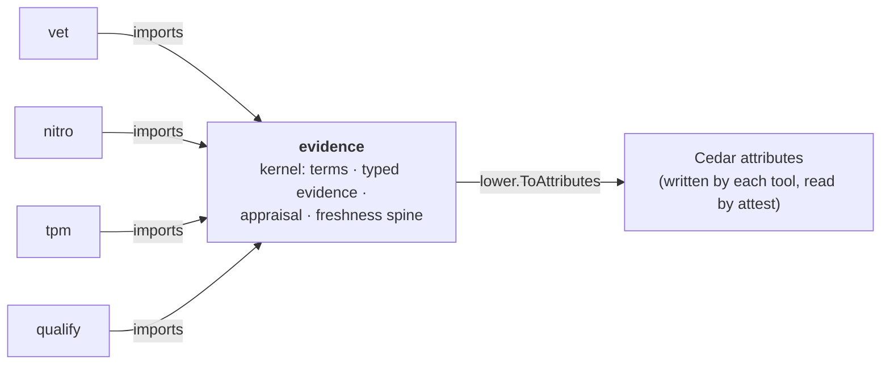

# provabl/evidence

**The Copland-model evidence kernel beneath Cedar for the Provabl suite.**

Part of the [Provabl](https://provabl.dev) suite:
- **[ground](https://ground.provabl.dev)** — deploy correct AWS foundations
- **[attest](https://attest.provabl.dev)** — compile, enforce, and prove compliance
- **[qualify](https://qualify.provabl.dev)** — train and qualify researchers
- **[vet](https://vet.provabl.dev)** — verify the software supply chain
- **evidence** — the attestation layer the others gather and appraise evidence through ← you are here

> Ground your infrastructure, attest your controls, qualify your people, vet your software.

---

The evidence kernel for the [provabl](https://provabl.dev) suite. The Copland
attestation model — terms, typed evidence, appraisal, freshness — in Go,
sitting one layer below Cedar.

Appraisal produces a verdict; Cedar acts on it. The kernel is the evidence
layer; `attest` stays the policy decision point. Each provabl capability
(`vet`, `nitro`, `qualify`, `attest`) becomes one `(ASP, appraiser)` pair
registered against the kernel. Two are implemented here: **`vet`** (supply-chain
provenance — freshness rides the kernel's outer SIG) and **`nitro`** (enclave
attestation — the appraiser binds the run's nonce natively against the NSM
document and verifies it to the `aws-nitro` trust root).

Unlike the other tools, the kernel is a **library others import**, not a service
they hand off to — the dependency points *inward* (tools → evidence), never out:



```bash
go test ./...          # green
go run ./cmd/slice     # kernel + vet + nitro, end to end
```

```
$ go run ./cmd/slice
evidence bundle:
  Signed[by=provabl-am-v1]
    Seq
      Nonce(32 bytes)
      Meas[asp=vet place=self status=collected]

verdict: pass=true  (all measurements collected and passed)

lowered Cedar attributes:
  attested                   = true     (bool)
  workload.cves_critical     = 0        (long)
  workload.signature_valid   = true     (bool)
  workload.slsa_level        = 2        (long)
  workload.subject_digest    = sha256:1f3a… (string)
```

## Install

evidence is a **library**, not a CLI — the other tools import it; there is no binary to install
(`cmd/slice` is a runnable end-to-end demo, not a product). Add it as a dependency:

```bash
go get github.com/provabl/evidence@latest   # requires Go 1.26.4+
```

**Prerequisites.** Go 1.26.4+ only — the kernel is **stdlib-only** (no third-party, no AWS). A
capability uses it by registering one `(ASP, appraiser)` pair; see `ARCHITECTURE.md` for the contract.

See `ARCHITECTURE.md` for the contract and `CLAUDE.md` for the build guide.

The one rule: the kernel does exactly five things — route, thread, stamp place,
apply the nonce/SIG/HSH built-ins, dispatch appraisal. All domain meaning lives
in the pairs. The day an ASP-specific branch appears in the kernel, the
abstraction has failed.

Apache-2.0 · © 2026 Playground Logic LLC
